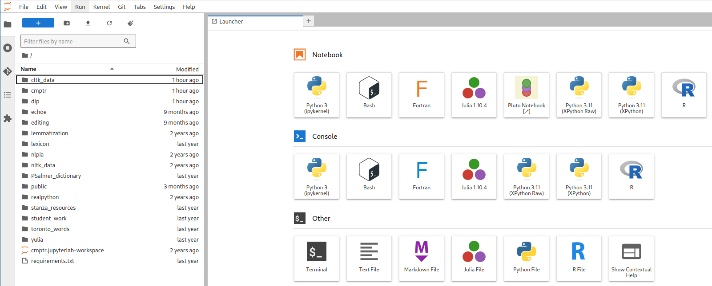

% Software
% P. S. Langeslag
% revision of \today

<!-- Process file as `pandoc -o Software.pdf Software.md --pdf-engine=xelatex --filter pandoc-crossref`. -->

---
documentclass: article
mainfont: Junicode
sansfont: "Noto Sans"
monofont: "DejaVu Sans Mono"
figPrefix:
    - "Figure"
    - "Figures"
tblPrefix:
    - "Table"
    - "Tables"
header-includes:
	- |
	  ```{=latex}
	  \definecolor{burgundy}{HTML}{990000}
	  \definecolor{darkgreen}{rgb}{0,0.422157,0}
	  \definecolor{mintgreen}{HTML}{40a170}
      \usepackage{hyperref}
	  ```
urlcolor: burgundy
highlight-style: tango
toc: true
subtitle: "Guide for students of Medieval Words, Modern Methods"
---

# Overview

This course will have you producing XML and CSS, as well as writing and running Python code. The present document describes how to get set up with software to do both. If you're new to this sort of thing, set aside plenty of time and prepare to follow a lot of manuals, ideally before the start of term! If you run into any obstacles, you may find solutions online; you can also use the Stud.IP forum to ask your peers for tech support as required. If this is all a bit much, remember that there will be no Python until the second half of term, so all that matters at the outset is to set up (Git and) VS Code for XML.

# Setting Up Git and VS Code for XML

In all my in-class instruction, I will assume that you are working in [Visual Studio Code](https://code.visualstudio.com/) (aka VS Code or Code). VS Code is an integrated development environment (IDE), essentially an advanced code editor. You are free to use other XML and Python editors if you are prepared to port all instructions accordingly.

## Installing Git

Git will only be used to distribute course materials, not to submit student work, and in fact you can get by perfectly well without it for the purposes of this course, as long as you keep an eye on any updates to the files on Stud.IP. But for the full experience, you'll want to [install](https://git-scm.com/book/en/v2/Getting-Started-Installing-Git) and [configure](https://git-scm.com/book/en/v2/Getting-Started-First-Time-Git-Setup) Git first, following the instructions in [the Pro Git book](https://git-scm.com/book/en/v2). Once you have it installed, configuration can be as simple as entering two lines like the following into your terminal (or entering your name and email into a graphical configuration assistant):

```bash
git config --global user.name "Firstname Lastname"
git config --global user.email your.email@stud.uni-goettingen.de
```

If you get stuck, you can bypass Git altogether; see [Cloning the Course Repository] below.

## Installing VS Code

Look for Visual Studio Code in your operating system's package manager (app store) or user repository, or else find it at <https://code.visualstudio.com>. Please note that several implementations of the app are available, and keyboard shortcuts given below will not work on all of them, or in all language editions.

Once you have it installed, launch Code and open the extensions manager (`Ctrl+Shift+X`) to install the `XML` extension (by Red Hat). You now have what you need to write XML; see [below](#navigating-vs-code) for a walkthrough of some of the app's key functionality. But first let's get you the course materials.

## Cloning the Course Repository

To obtain the course files from within VS Code, make sure you close any open projects/folders (File &gt; Close Folder, or `Ctrl+K Ctrl+F`), then navigate to Source Control (`Ctrl+Shift+G`) in the lefthand pane, select "Clone Repository", and paste in `https://github.com/langeslag/words-methods.git`. If Git is correctly set up, the course files should now be downloaded into a folder of your choice and listed in the documents pane. If for any reason you cannot get beyond this step, you can visit <https://github.com/langeslag/words-methods/>, select "Code" and "Download source code: zip", and extract the archive to a location of your choice (or download the files from Stud.IP, where I have mirrored them). Just remember to redownload any changed files down the road.

# Navigating VS Code

## Default Keybindings

VS Code provides a great many keybindings. So many, in fact, that it has to rely on sequences of key presses ("chords"). Here you can typically keep your modifier key (i.e. `Ctrl` or `Command`) down while you press a sequence of letters, styled in documentation as e.g. `Ctrl+K Ctrl+O`, or sometimes simply `Ctrl+K O`. The present manual refers to PC shortcuts; their macOS counterparts typically substitute `Command` for `Ctrl`, and I've found that some of the key chords advertised in the app itself don't work in at least some of the Linux implementations. See further [Custom Keybindings] below.

## File Templates

VS Code lacks a native approach to file templates. The easiest solution is simply for you to duplicate `template.xml` manually and edit the new file only. Make sure not to make any changes to the template file itself, or to any of the other files provided, as these are tracked by Git, so conflicts will ensue if you change them locally and then try to update your working copy. To return your working copy to its original state as downloaded, enter `git reset --hard` (this will not affect untracked files, so your own files should be safe).

## Custom Keybindings

If you regularly transcribe documents that contain special characters, you may want to register keybindings for them. (Refer to this section only for common unicode characters that display well in fixed-width fonts; for other use cases see the section on entities in the [XML guide](https://github.com/langeslag/words-methods/blob/main/doc/XML.pdf).) As noted above, VS Code has a lot of keybindings already registered, so you will either have to look for unused combinations or override keybindings for functions you don't expect to use. On a US keyboard (but probably not on a keyboard with German layout), `Alt+` `` ` `` ("backtick") is a conveniently available initial "base note" for a chord, which you can combine with letter keys for the characters you need; you'll have to see for yourself what works best on your keyboard layout, and modify the below examples accordingly.

Custom keybindings are stored in a JSON file. JSON is a widely used data storage format. You'll get used to it by using it; for the time being you just need to be able to reproduce structures like those printed below.

To access the keybindings file, open the Command Palette (`Ctrl+Shift+P`, or `F1`) and start typing `Preferences: Open Keyboard Shortcuts (JSON)`, and select that option once it comes up. This opens `keybindings.json` in the editor. For the time being, the file is almost empty:

```json
// Place your key bindings in this file to override the defaults
[]
```

What you'll want to do now is enter the desired keybindings in between the square brackets as follows:

```json
[
    {
        "key": "alt+` w",
        "command": "type",
        "args": {
            "text": "ƿ"
        }
    },
	{
        "key": "alt+` s",
        "command": "type",
        "args": {
            "text": "ſ"
        }
    },
]
```

The keybindings should work as soon as you save the file. The validator will tell you if you've got anything wrong, e.g. if you've forgotten a bracket, comma, or quotation mark. For more on VS Code keybindings, see the [documentation](https://code.visualstudio.com/docs/getstarted/keybindings).

__Please note:__ macOS has a lot of keybindings hardcoded into the operating system that will either override anything you might have defined yourself or else yield undesired content alongside it. This makes the process of identifying suitable keyboard shortcuts considerably harder on macOS. The same is true to a lesser extent of most non-English keyboard layouts across all operating systems.

# Setting Up Python and Jupyter

In order to make use of VS Code's Python and Jupyter functionality, you will now have to install their standalone distributions. To keep this section brief, I will only print instructions for Anaconda here. If you prefer other approaches, see [Appendix 1: Python without Anaconda].

## Anaconda

To install Anaconda, head to [anaconda.com](https://www.anaconda.com/) and select "Free Download", look for the small print to "skip registration" to download the installer without sharing your email address (unless you don't mind), and select your operating system and processor architecture. You will need a few gigabytes of free disk space. When opening Anaconda Navigator, you can, if you like, dismiss prompts to set up an account to gain access to AI assistance and other online features. At this point you may want to update Anaconda Navigator to the latest version before undertaking further action.

--------------------------------------------------------------------------------------
**NOTE**

Best practice is to set up distinct Python environments for your various Python needs. Since for this course we will only use a bare minimum of Python libraries, there is no need to do so; but you can read up on the process [here](https://docs.anaconda.com/navigator/tutorials/manage-environments/#creating-a-new-environment) if you're interested. If you do create a custom environment, going forward you'll always need to check that the correct environment is activated, as libraries installed in one environment won't exist in another.
--------------------------------------------------------------------------------------

## Preparing VS Code for Python and Jupyter

To turn VS Code into a Python editor, open the extensions manager (`Ctrl+Shift+X`) and install the extensions entitled Python (by Microsoft), Python Environments (by Microsoft; agree to install the pre-release if no final release is available), and Jupyter (by Microsoft). _If you cannot find Python Environments, it may be because you have installed the open-source implementation of VS Code rather than the proprietary Microsoft release. You can try installing another Python environments extension, such as that by Solarzano-JuanJose, and see how you fare._ 

## Package Management

For Python package management, you have three options available to you. If you lack experience working on the command line, you may use Anaconda Navigator to install and manage libraries in the Environments tab, or in your Jupyter notebook you can issue commands like `!conda install matplotlib` directly within your code cells to install the library called `matplotlib`.

Traditionally, however, Python package management is done from the command line, using the command `conda` (or `pip` if you are working without Anaconda). To go this way from within VS Code, with our repository folder open, select "Terminal" and "New Terminal" (or Ctrl+Shift+`` ` `` on US keyboards) to open a terminal window with the current folder as its working directory. You can install individual packages by issuing commands like `conda install matplotlib`.

If in your work you ever encounter an error along the lines of `ModuleNotFoundError: No module named 'gensim'`, simply install the missing package (`conda install gensim` on the command line, or `!conda install gensim` in your notebook) and get on with your work.

Remember that if you have activated a virtual environment for this folder (e.g. by selecting it in Anaconda), packages are installed in that virtual environment, whereas if you haven't, they are installed to your global Python installation or Anaconda `base` environment. Either way, packages are only available from within the environment in which they were installed.

## JupyterLab Remote: The Python Fallback Option

If you are new to all this, and setting up Python, Jupyter, and Git is beyond you, you may alternatively choose to do the Python part of your work in-browser in GWDG's remote JupyterLab instance at <https://jupyter-cloud.gwdg.de>, following the instructions in [Appendix 2: JupyterLab Remote].

# Appendix 1: Python without Anaconda

If you prefer to use the more traditional `pip` package manager over `conda`, you will want to go over the [installation instructions at Real Python](https://realpython.com/installing-python/), or at least the briefer installation notes at the top of VS Code's [Get Started With Python tutorial](https://code.visualstudio.com/docs/python/python-tutorial). You will have to install Jupyter Notebooks separately. Basic installation instructions are at [jupyter.org](https://jupyter.org/install), but they assume you are comfortable with Python package management already; `pip` instructions are [here](https://pip.pypa.io/en/stable/getting-started/), and even they assume you know to open a terminal (in Windows, use PowerShell) and issue your commands there; as per usual, the relevant [Real Python article](https://realpython.com/what-is-pip/) has more detail. If you want to create a custom Python environment using `pip`, consult [the relevant Real Python article](https://realpython.com/intro-to-pyenv/) for guidance.

# Appendix 2: JupyterLab Remote

If you run into any insurmountable issues when trying the local install, you can take the Python part of your work online. Since JupyterLab doesn't have an XML editor, however, you'll still want to do all your XML work locally in VS Code or a similar editor, so please follow the above instructions to the extent that you can.

One drawback to JupyterLab is that although your work is safely stored, Python packages are lost between sessions and will have to be reinstalled every time you do a stint of work (though since we won't use all that many libraries as part of this course, that shouldn't be too great an obstacle). In fact, an advantage of the GWDG environment is that it allows your instructor to reproduce any issues exactly, <!--and all demo notebooks used in the course have been tested against it, -->whereas your instructor cannot help you with any local package conflicts or other software issues if you install Python on your own system. Additionally, the remote option saves you from having to set up Python, Jupyter, and Git yourself.

## Accessing JupyterLab Remote

To use GWDG's instance of JupyterLab, first activate your GitLab account by logging in at <https://gitlab.gwdg.de> if you have never done so before. Then log in at <https://jupyter-cloud.gwdg.de>. You may select the default image when prompted. If you aren't returning to an active or saved workspace, JupyterLab should open to a launcher window resembling @fig:interface.

## Cloning the Course Repository

In the JupyterLab launcher window, from the category "Other" select "Terminal". This opens a command-line interface answering to many of the same commands you may know from UNIX-like systems such as Linux or macOS. To clone the repository, paste the following command into your JupyterLab terminal and hit Enter:

```bash
git clone https://github.com/langeslag/words-methods.git
```

This should create a folder `words-methods/` and populate it with our course files. The folder will appear in the file system in the left-hand pane. Once it's done cloning, you can close the terminal window (click `x` or type `exit`) and double-click the `words-methods/` folder on the left. Nothing changes except the current folder (or "working directory"). Now if you start Python 3, the files you've pulled in are available within your working directory.

{#fig:interface}

If the course materials should ever be updated in the course of the term, you'll have to update your working copy to take advantage of these changes. To do so, enter the `words-methods/` folder in the file system, launch a terminal window, and enter `git pull`. Once the line `Writing objects` reaches 100%, your working copy is up to date and you can close the window. If you receive a warning that your working copy contains changes not in the master branch, you can override changes you made to the distributed files by issuing `git reset --hard`. Do make sure not to lose any files you have yourself created; this can be avoided by writing only to files with file names other than those tracked by (which in our case are those originally supplied as part of) the repository.

## Package Management

Our textbooks assume that you have access to a Python package manager, usually `pip` or `conda`, on the command line. GWDG's remote instance of JupyterLab in fact incorporates `pip` directly into the interpreter, so to install a Python package like `lexicalrichness` you can type `!pip install lexicalrichness` directly into your notebook or console, or you can take the more conventional route and do your package management from within a terminal window using commands like `pip install lexicalrichness`.

The remote instance of JupyterLab does not save your Python libraries: the next time you log in, your packages will be gone. You might therefore want to have one or more `!pip install` commands in your first code cell (the command can have multiple arguments), and run this cell once when starting a stint of work. Likewise, if in your work you ever encounter an error along the lines of `ModuleNotFoundError: No module named 'gensim'`, simply install the missing package (`pip install gensim` on the command line, or `!pip install gensim` in your notebook) and get on with your work.
